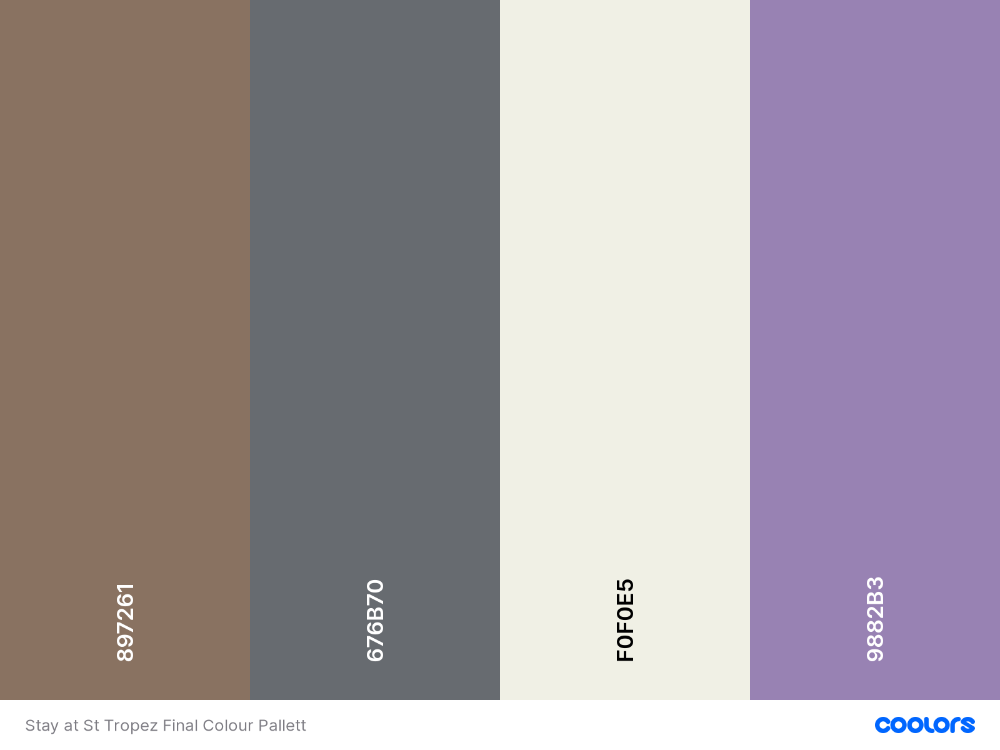

# Stay In St Tropez

[Stay In St Tropez Live site](https://alicepinch.github.io/stay-in-st-tropez/)

Stay in St Tropez is a website designed to provide information to users who want to visit the area. The website aims to promote all of the different places and activities available in the tourist location. The website also aims to help regular visitors to the
 
## UX

The UX goal for this website is to provide users with information about St Tropez in a more interactive way than a static website would. This interactive website aims to create a more personalised experience for the user and allows them to explore different elements throughout. 

#### User stories:

- Research & Planning for a holiday or day out
- Explore the different Restaurants to visit via the map. 
- Explore the different Beachs to visit via the map.
- Explore the different Vineyards to visit via the map. 
- Explore the different Hotels to stay at via the map. 
- Contact in case of further questions/ information.

#### Returning User:

- To be able to get in contact for further information.
- To be able to review any new locations that may have been added.

#### Site Owner:
- To provide useful information to the user if they wanted to visit St Tropez.
- For the site to be easy to use and navigate with a simple but aesthetically pleasing design.
- To include multiple options for different activities and things to do as well as places users could Stay in St Tropez.
 
### Strategy
---

### Scope 
---

### Structure 
---

The site has been built using just one page where the user can navigate through to the each different section via the navigation at the top of the page. A scroll to top button has been implemented to appear when the user scrolls down so that they can easily access the navigation again if needed. The navigation includes three links to different sections on the page. These sections are:

#### About Us Section:

The about us section includes a brief introduction to St Tropez with and a little bit about the town itself and the area in which it is in. This section also included a hidden video that users can view if they click the "Watch Video" button.

#### Explore Section:

The explore section includes the Google map API where the user can click on one of the 4 buttons available to display different locations on the map. This section also anchor links down the the contact section for easy access to the form if users want to get in touch. 

#### Top Recommendations:

The top recommendations section s available after the google maps for users to view our recommendations on where to visit. This section is not accessed via the top navigation as is and added section of 'Explore'.

#### Contact Us: 

The contact form is accessed via the top navigation as well as anchor linked from the explore section. This is a simple inquiry form for users to send any questions they may have. 

#### Footer:

The footer is a simple only including social media links. 

### Skeleton
---

The plan for this website was to be a single page with 3 main different sections all accessed via the navigation. This website was built with desktop in mind however it has been optimized so that it can be used accross devices.

Wireframes were created using balsamiq:

### Surface
---

#### Design:
For the overall design of this project I wanted it to be simple yet asthetically pleasing ensuring I captured the look and feel of the South of France.

#### Typography:
The fonts that I have decided to use for this project are Poppins and Roboto from Googlefonts. The fall back font that I am using is sans-sherif. Poppins has been used for all headings and Roboto for the rest of the text on the website.

#### Colour Scheme
The colours used throughout the website were chosen as these are the colours usually associated with the South of France. Lavender is the flower of the Provence so I wanted to ensure that this was used throughout. The beige background represents the buildings and the brown represents the classic shutter you would find on a french chateau. As the colours that have been used are soft I chose to use a shade of grey too compliment this for for the body text, website name and logo. The lavender has been used for all CTA's, links and subheadings through the website. The brown has been used as the hover colour for all links and CTA's. 

## Features

#### Existing Features

- Explore St Tropez section includes a Google Map API with buttons for customers to click through to explore different tourists locations. 
- Contact From - Contact form linking through to the emailJS API for users to get in contact for more information.
- About Section with expandable video section.
- Top recommendations for restaurant, beach club and vineyard with expandable 'More details' section.
- One pager website - All content is on one page accessed via the navigation at the top of the page. 
- Footer - simple footer with social media links. 
- Simple navigation - Easy navigation with links to the different sections further down the page. 
- Accessibility - Accessible links and appropriate alt attributes across the website.
- Scroll to top button 
- As the page is a one pager, I have implemented a scroll to top page so that users can easily get back to the top of the page if needed. 
- Responsive website for different screen views. 

#### Future Features Left to Implement

- A subscription modal so users can sign up and recieve newsletters on all things St Tropez. 
- An option for customers to switch between French content and English content.
- Different recommendations appearing depending on which button was clicked in the 'Explore' area.
- A list of all locations next to the map when the buttons are clicked so the informatin is clearer.

## Technologies Used

### Languages Used
---

- [JQuery](https://jquery.com)
 - The project uses JQuery to simplify DOM manipulation.
- Javascript 
 - The project uses vanilla javascript to create an interactive website
- HTML - The main structure of this website was built using HTML5
- CSS - This project was styled using CSS

### Other tools used
---

- Google API's - This project uses google API's to pull in different locations for tourist hotspots in St Tropez
 - https://developers.google.com/maps/documentation/javascript/examples - followed tutorials on how to implement
- Font awesome - Used for the logos in the Visit us section and homepage.
- Google fonts - To import "Roboto and Poppins font" to be used across the website.
- Bootstrap - To help with creating a responsive website using their grid system.
- Balsamiq - To create the wireframes for Desktop, Tablet and Phone.
- Gimp - Used to resize images.
- Tinypng - Ran all images through tinypng to compress.
- W3Schools - For small code questions throughout the project.
- Stackoverflow - Used to assist with small code questions. 
- Coloors - Used to create the colour pallett.
- freelogodesign - To create the logo for Stay In St Tropez.
- Favicon generator - To convert the logo into a favicon.ico file.
- Snook - Used to help with the slideshow at the top of the page. 

## Testing

All the testing carried out for Stay In St Tropez can be found here.

## Deployment

This project was created in Gitpod workspaces and pushed to Github regularly. To deploy this project to github the process was:

- Open the 'Stay-in-st-tropez'repository on github
- Go to settings
- Scroll down to 'Github pages' section
- Select the master branch as the source, save these changes.
- After refreshing the page the repo is published and the URL is generated.
- The Stay In St Tropez page can be accessed via: https://alicepinch.github.io/stay-in-st-tropez/

## Cloning:
In order to clone a local copy of a repository to your computer you need to follow the following steps.

- Click on the 'Code' button next to 'Add a file' when you have opened a repository
- To clone your respository by https:// click on the clipboard icon next to the URL.
- Once you have done this, open the terminal
- The current directory will need to be changed to where you want your cloned directory.
- Type 'git clone' and then paste in your URL from the earlier steps ($ git clone https://github.com/alicepinch/stay-in-st-tropez)
- Press enter

More details can be found via the github doc https://docs.github.com/en/github/creating-cloning-and-archiving-repositories/cloning-a-repository.

## Credits

### Content

- Content was mostly writen by myself due to visiting the area many times with the help of wikipidea and google maps.

### Media

The photos used in this site were all copyright free and taken from the following websites:

- https://www.rawpixel.com/
- https://www.pexels.com/
- https://unsplash.com/
