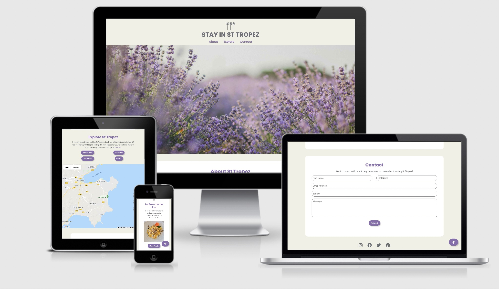

# Stay In St Tropez

[Stay In St Tropez Live site](https://alicepinch.github.io/stay-in-st-tropez/)

Stay in St Tropez is a website designed to provide information to users who want to visit the area. The website aims to promote all of the different places and activities available in the tourist location. 

## Table of Index: 
- [UX](#ux)
   - [Strategy](#strategy)
   - [Scope](#scope)
   - [Structure](#structure)
   - [Skeleton](#skeleton)
   - [Surface](#surface)
- [Features Implemented](#features-implemented)
- [Technologies Used](#technologies-used)
- [Testing](TESTING.md)
- [Deployment](#deployment)
- [Credits](#credits)
 
## User Experience 

### Strategy

The UX goal for this website is to provide users with information about St Tropez in a more interactive way than a static website would. This interactive website will aim to create a more personalised experience for the user and allow them to explore different elements throughout. The website should be easy to navigate and simple to interact with to give the user the best experience.

#### User stories:

- As a user I would like to explore the different Restaurants I can visit.
- As a user I would like to explore the different Beaches I can visit.
- As a user I would like to explore the different Vineyards I can visit.
- As a user I would like to explore the different Hotels I can stay if I visit.
- As a user I would like to be able to get in contact in case of further questions/information.
- As a user I would like to get a vibe of the area and gain some basic background information.

#### Returning User:

- As a returning user I would like to be able to get in contact for further information.
- As a returning user I would like to be able to view all of the current locations on the map/ and any new ones that may have been added. 
- As a returning user I would like to be able to access the, contact information or details for different places to eat, visit or stay.

#### Site Goals:

- To provide useful information to the user if they want to visit St Tropez.
- For the site to be easy to use and navigate with a simple but aesthetically pleasing design.
- To include multiple options for different activities and things to do as well as places users could Stay in St Tropez.
- To create a pleasant experience so that a user would like to revisit the website and the information provided.
- To showcase all skills learnt from HTML, CSS and Javascript.
 
### Scope 

#### Planned features:

- Page Heading & Navigation
- Interactive buttons to display content throughout
- Google Maps API
- Working Contact form with EmailJS 
- Footer with social links
- Recommendations which will change when different buttons are selected

### Structure 

The site will be built using just one page so a user can navigate through to the website either via the navigation at the top of the page or just by scrolling. A scroll to top button will be implemented so that when a user scrolls down on the page, they can easily access the navigation again if needed. The navigation will include three links to different sections on the page 'About St Tropez', 'Explore St Tropez' and 'Contact'.

### Skeleton

This website will be built with desktop in mind however it will be optimized for other devices. Wireframes were created using balsamiq:

### Surface

#### Design:
For the overall design of this project I wanted it to be simple yet aesthetically pleasing ensuring I captured the look and feel of the South of France throughout.

#### Typography:
The fonts that I have decided to use for this project are Poppins and Roboto from Googlefonts. The fall back font chosen is sans-sherif. Poppins has been used for all headings and Roboto for all other text on the website. I chose these fonts as they were simple, clean and complimented each other well.

#### Colour Scheme
The colours used on the website were chosen as these are the colours usually associated with the South of France. Lavender is the flower of the Provence so I wanted to ensure that this was used throughout. The beige background represents the buildings and the brown represents the classic shutter you would find on a French chateau. As the colours that have been used are soft, I chose to use a shade of grey to compliment this for the body text, website name and logo. The lavender has been used for all CTA's, links and subheadings on the website. The brown has been used as the hover colour for all links and CTA's. 

## Features Implemented

#### SlideShow of Images

When first entering the website the user is presented with a hero slideshow with 4 different rotating images which aim to give a visual to users of St Tropez. This was implemented using jQuery to manipulate the dom following a Snook tutorial which is outlined in my Code.

#### Watch Video CTA

The 'About St Tropez' section features a 'Watch Video' CTA which users can click on to display a promotional YouTube video for St Tropez. 

#### Google Map API

The 'Explore St Tropez' section of the website features an interactive google map API where customers are able to view different locations by clicking on one of the buttons above the map. 

#### Scroll to top button

When a user scrolls 200px from the top of the page then a button with an arrow pointing to the top of the page appears. This feature allows the user to get back to the top of the page easily as there is no fixed navigation.

#### EmailJS form

EmailJS has been used to implement a working form. This allows customers to fill out the contact form and when a submitted they will be alerted with a success message and the details will come through to my email. 

#### More Details

The 'Recommendations' section features three 'More Details' CTA's which users can click on to toggle display more information for each different recommendation.

#### Navigation

A navigation has been implemented at the top of the page with anchor links to the different sections. This was not fixed due to being a one page website and the scroll to top feature. 

#### Accessibility

Aria-labels and alt attributes added to all links and images across the website to ensure it meets all accessibility needs. 

#### Footer

Simple footer implemented with social links.

#### Responsiveness

This website is responsive and can be used across web browsers and different device sizes. Max-width was used for the different component sections to ensure that this could be scaled up as well as down correctly. 

### 404 page

A 404 page has been created and styled so that if a user was to try and access a page that was not available or the user misspelled the web domain name then the 404 page could take them back to the homepage. 

#### Future Features

- A subscription modal so users can sign up and receive newsletters on all things St Tropez. 
- An option for customers to switch between French content and English content.
- Different recommendations appearing depending on which button was clicked in the 'Explore' area (This was outlined in planned features however there was no time to implement this so it would be a future feature)
- A list of all locations next to the map when the buttons are clicked so the information is clear.

## Technologies Used

- [JQuery](https://jquery.com)
  - The project uses JQuery to simplify DOM manipulation.
- JavaScript 
  - The project uses JavaScript to create interactive elements and link API's.
- HTML 
  - The main structure of this website was built using HTML5
- CSS 
  - This project was styled using CSS
- [Google map API's](https://developers.google.com/maps/documentation/javascript/examples)
  - This project used Google map API's to implement an interactive map.
- [EmailJS API](https://emailjs.com/) 
   - EmailJS was used to link any user inquiries through to an email.

### Other tools used

- [Google Map tutorials](https://developers.google.com/maps/documentation/javascript/examples) - Followed instructions on how to implement the interactive map on the website. 
- [Font Awesome](https://fontawesome.com/) - Used for the logos in the Visit us section and homepage.
- [Google fonts](https://fonts.google.com/) - To import "Roboto and Poppins font" to be used across the website.
- [Bootstrap](https://getbootstrap.com/) - To help with creating a responsive website using their grid system.
- [Balsamiq](https://balsamiq.com/) - To create the wireframes for Desktop, Tablet and Phone.
- [Gimp](https://www.gimp.org/) - Used to resize images.
- [Tinypng](https://tinypng.com/) - To compress all images.
- [W3Schools](https://www.w3schools.com/) - For code questions throughout the project. Outlined in code where used for scroll function.
- [StackOverflow](https://stackoverflow.com/) - For code questions throughout the project. 
- [Coloors](https://coolors.co/) - Used to create the colour pallett.
- [freelogodesign](https://www.freelogodesign.org/) - To create the logo for Stay In St Tropez.
- [Favicon generator](https://www.favicon-generator.org/) - To convert the logo into a favicon.ico file.
- [Snook](https://snook.ca/archives/javascript/simplest-jquery-slideshow) - Used to help with the slideshow at the top of the page. 
- [JShint](https://jshint.com/) - To test JavaScript.
- [W3cValidator](https://validator.w3.org/) - Used to check HTML and CSS for any issues.
- [Free formatter](https://www.freeformatter.com/css-beautifier.html#ad-output) - Used to beautify CSS code.

## Testing

All the testing carried out for Stay In St Tropez can be found [here](TESTING.md).

## Deployment

This project was created in Gitpod workspaces and pushed to GitHub regularly. To deploy this project to GitHub the process was:

- Open the 'Stay-in-st-tropez' repository on GitHub
- Go to settings
- Scroll down to 'GitHub pages' section
- Select the master branch as the source, save these changes.
- After refreshing the page the repo is published and the URL is generated.
- The Stay In St Tropez page can be accessed via: https://alicepinch.github.io/stay-in-st-tropez/

## Cloning:
In order to clone a local copy of a repository to your computer you need to follow the following steps.

- Click on the 'Code' button next to 'Add a file' when you have opened a repository
- To clone your repository by https:// click on the clipboard icon next to the URL.
- Once you have done this, open the terminal
- The current directory will need to be changed to where you want your cloned directory.
- Type 'git clone' and then paste in your URL from the earlier steps ($ git clone https://github.com/alicepinch/stay-in-st-tropez)
- Press enter

More details can be found via the [GitHub docs.](https://docs.github.com/en/github/creating-cloning-and-archiving-repositories/cloning-a-repository)

## Credits

- The google map API's were created following the google map tutorials available https://developers.google.com/maps/documentation/javascript/example and the code was adjusted and modified for my needs for this project. 
- YouTube https://www.youtube.com/watch?v=09ck9iz4fEw&t=129s for the video used on webpage. 
- All phone numbers and addresses and booking URL's were taken from google. 

### Content

- Content was mostly written by myself from visiting the area many times with the help of wikipidea and google maps.

### Media

The photos used in this site were all copyright free and taken from the following websites:

- https://www.rawpixel.com/
- https://www.pexels.com/
- https://unsplash.com/
